# Lab 01 - Users and Privileges
Rafael Trevizoli - 1460282423016  
Professor Carlos Augusto Lombardi Garcia

**Topic:** [ADM_BD_01_privilegios.pptx](topic/ADM_BD_01_privilegios.pptx)  
**Lab:** [ADM_BD_01_privilegios.pptx](lab/ADM_LAB_01_PRIVILEGIOS.txt)

## Execution instructions
Each item of the experiment must be carried out and its result documented in the report.

## Lab objective
Understand and study the data dictionary views and the Oracle commands that manage user privileges.

> Some dictionary views will be used for this purpose.  

## Connect with the user SYSTEM
<p align="center">
    <br>
    <em>Img 01 - Testing connection into orcl with SYSTEM (Success)</em>
</p>

## Explain the purpose of the v$version view

`V$VERSION` displays the version number of Oracle Database. The database components have the same version number as the database, so the version number is returned only once.

```SQL
SELECT * FROM v$version; -- explique a finalidade da visão v$version.
```

<p align="center">
    <br>
    <em>Img 02 - Select * from v$version view</em>
</p>

## Explain the purpose of the dba_users view

`DBA_USERS` describes all users of the database.

```SQL
SELECT username FROM dba_users;  -- explique a finalidade da visão dba_users.
```

<p align="center">
    <br>
    <em>Img 03 - Select username from dba_users view</em>
</p>

## Create the user USR_LAB01

```SQL
CREATE USER USR_LAB01 IDENTIFIED BY SENHA default tablespace users  quota unlimited on users;  
```

<p align="center">
    <br>
    <em>Img 04 - Creation of the user USR_LAB01</em>
</p>

## Explain the purpose of the roles (CONNECT and RESOURCE)
### CONNECT
The `CONNECT` role has only the `CREATE SESSION` privilege, all other privileges are removed.

Although the `CONNECT` role has frequently been used when provisioning new accounts in the Oracle database, simply connecting to the database does not require all those privileges. Making this change enables new and existing database customers to enforce good security practices more easily.

Each user should have only those privileges appropriate to the tasks she needs to do, an idea termed the principle of least privilege. Least privilege mitigates risk by limiting privileges, so that it remains easy to do what is needed while concurrently reducing the ability to do inappropriate things, either inadvertently or maliciously.

### RESOURCE
The `RESOURCE` role grants a user the privileges necessary to create procedures, triggers and, in Oracle8, types within the user’s own schema area. Granting a user `RESOURCE` without `CONNECT`, while possible, does not allow the user to log in to the database. Therefore, if you really must grant a user `RESOURCE`, you have to grant `CONNECT` also — or, at least, `CREATE SESSION` — so the user can log in.

```SQL
GRANT CONNECT, RESOURCE to USR_LAB01;  -- explique pela documentação da oracle a finalidade das roles connect e resource
```

<p align="center">
    <br>
    <em>Img 05 - Grant CONNECT and RESOURCE to USR_LAB01</em>
</p>

## In another window connect with the user created above

```SQL
-- abra outra janela e conecte com o usuário criado acima. Foi possível conectar?
```

<p align="center">
    <br>
    <em>Img 06 - Testing connection into orcl with USR_LAB01 (Success)</em>
</p>

## Change the passwaord of USR_LAB01 connected with SYSTEM

```SQL
-- execute o comando abaixo na janela conectado como SYSTEM
ALTER USER USR_LAB01 IDENTIFIED BY new_password;
```

<p align="center">
    <br>
    <em>Img 07 - Alter USR_LAB01's password connected as SYSTEM</em>
</p>

## Check the connection of USR_LAB01 in its window

```SQL
-- Volte na janela do usuário criado e verifique se ele continua conectado através do comando abaixo:
select table_name from all_tables;
```

<p align="center">
    <br>
    <em>Img 08 - Select all tables as the user USR_LAB01</em>
</p>

## Reconect as USR_LAB01

Reconnecting as USR_LAB01 with the same password throws me the error `Status: Failure -Test failed: ORA-01017: invalid username/password; logon denied`. Its the reflect of the password that was changed.

A new connection was successfully established using the new password.

```SQL
-- encerre a conexão dessa janela e tente conectar novamente usando a mesma senha. Você conseguiu conectar? Tente usar a nova senha alterada no comando ALTER USER. O que aconteceu?
```

<p align="center">
    <br>
    <em>Img 09 - Connecting as USR_LAB01 with the old password</em>
</p>

<p align="center">
    <br>
    <em>Img 10 - Connecting as USR_LAB01 with the new password</em>
</p>

## In the SYSTEM user window, run the command below

```SQL
-- a partir da janela do usuário system execute os comandos abaixo.
```

### Show user

```SQL
SHOW USER;
```

<p align="center">
    <br>
    <em>Img 11 - Show user</em>
</p>

### Create table in SYSTEM user

The command below creates the xtz table in the `SYSTEM` user schema.

```SQL
CREATE TABLE xyz (name VARCHAR2(30));  -- esse comando cria a tabela xyz em qual usuário? 
```

<p align="center">
    <br>
    <em>Img 12 - Create table xyz</em>
</p>

### Create table in USR_LAB01 using SYSTEM user

The command below creates the xtz table in the `USR_LAB01` user schema using the `SYSTEM` user.

The `CREATE ANY <object_type>` privilege is required to create objects in other database schemas. 

```SQL
CREATE TABLE USR_LAB01.xyz (name VARCHAR2(30));  -- esse comando cria a tabela xyz em qual usuário? Que nível de privilégio foi necessário para que isso seja possível?
```

<p align="center">
    <br>
    <em>Img 13 - Create table xyz in the USR_LAB01 user schema</em>
</p>

## Desc `<table>`

```SQL
-- volte na janela do usuário USR_LAB01 e rode o comando abaixo. Se ele funcionar é que a tabela pertence a esse usuário.
```

### Own schema

```SQL
DESC xyz;
```

<p align="center">
    <br>
    <em>Img 14 - Desc table xyz as USR_LAB01</em>
</p>

### Other user schema

This command returns the error `ERROR: ORA-04043: object system.xyz does not exist` because the `USR_LAB01` user does not have visibility of the `SYSTEM` user schema.

```SQL
DESC system.xyz;   -- esse comando funcionou? O que falta ao usuário USR_LAB01 para que esse comando funcione?
```

<p align="center">
    <br>
    <em>Img 15 - Desc xyz table of the SYSTEM user schema</em>
</p>

## Grant `<table>` privileges to `<user>`

```SQL
-- volte na janela do usuário SYSTEM
```

### Creat user `USR_LAB02`

```SQL
CREATE USER USR_LAB02 IDENTIFIED BY SENHA default tablespace users;
```

<p align="center">
    <br>
    <em>Img 16 - Creation of the user USR_LAB02</em>
</p>

### Grant `<table>` privileges

Below is a privilege grant operation, that allows `USR_LAB02` to (**INSERT** | **DELETE** | **SELECT**) on the xyz table in the `USR_LAB01` user schema.

```SQL
GRANT INSERT, DELETE, SELECT ON USR_LAB01.XYZ TO USR_LAB02;  -- que operação está acontecendo aqui?
```


<p align="center">
    <br>
    <em>Img 17 - Grant table privileges to user USR_LAB02</em>
</p>

### Grant `<connect>` role

```SQL
grant connect to USR_lab02;
```

<p align="center">
    <br>
    <em>Img 18 - Grant CONNECT role to user USR_LAB02</em>
</p>

### Check `<table>` privileges

This query returns the privileges granted to the user `USR_LAB02`.

```SQL
select * from dba_tab_privs where grantee = 'USR_LAB02';   -- qual o significado do resultado dessa consulta? 
```

<p align="center">
    <br>
    <em>Img 19 - Check the user USR_LAB02 privileges</em>
</p>

## Test the privileges granted to `<user>`  

```SQL
-- abra uma nova janela e conecte com o usuário usr_lab02. Execute o comando abaixo.
```

### Insert

```SQL
insert into usr_lab01.xyz values ('teste de nome');

commit;
```

<p align="center">
    <br>
    <em>Img 20 - Test the user USR_LAB02 insert privilege in the USR_LAB01.xyz table</em>
</p>

### Select

#### Select with proper privilege

The command below was executed successfully because `USR_LAB02` was granted the `SELECT` privilege on this table.

```SQL
select * from usr_lab01.xyz;  -- mostre o resultado desse comando e explique por que ele funcionou.
```

<p align="center">
    <br>
    <em>Img 21 - USR_LAB02 executes a SELECT query in the USR_LAB01.xyz table</em>
</p>

#### Select with proper privilege

The command returns the error `ORA-00942: table or view does not exist` because the user `USR_LAB02` does not have the necessary privileges to access objects in the `SYSTEM` schema.

```SQL
select * from system.xyz; -- mostre o resultado desse comando e explique por que ele NÃO funcionou.
```

<p align="center">
    <br>
    <em>Img 22 - USR_LAB02 executes a SELECT query in the SYSTEM.xyz table</em>
</p>

#### Select in own schema

The command returns the error: `ORA-00942: table or view does not exist` because in the `USR_LAB02` schema do not exists the xyz object.

```SQL
select * from xyz; -- mostre o resultado desse comando e explique por que ele NÃO funcionou.
```

<p align="center">
    <br>
    <em>Img 23 - USR_LAB02 executes a SELECT query in its own schema</em>
</p>

## In the USR_LAB01 user window, run the command below

```SQL
-- na janela do usuário usr_lab01.
-- a visão dba_sys_privs requer privilégio específico para ser acessada. O usuário usr_lab01 ainda não tem esse privilégio. rode o comando abaixo e veja se funciona?
```

```SQL
select * from dba_sys_privs;
```

<p align="center">
    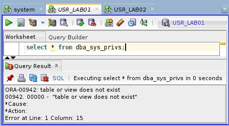<br>
    <em>Img 24 - User USR_LAB01 executes a SELECT query on dba_sys_privs table</em>
</p>

## New role

```SQL
-- na janela do usuário system.
```

### Create

```SQL
CREATE ROLE new_dba;
```

<p align="center">
    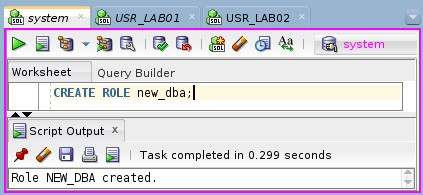<br>
    <em>Img 25 - SYSTEM creates a new role named new_dba</em>
</p>

### Grant CONNECT

```SQL
GRANT CONNECT TO new_dba;
```

<p align="center">
    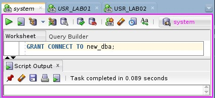<br>
    <em>Img 26 - Grant CONNECT to new_dba</em>
</p>

### Grant SELECT ANY TABLE privilege

```SQL
GRANT SELECT ANY TABLE TO new_dba;
```

<p align="center">
    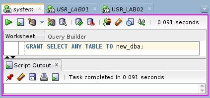<br>
    <em>Img 27 - Grant SELECT ANY TABLE privilege to new_dba</em>
</p>

### Grant SELECT_CATALOG_ROLE

```SQL
GRANT select_catalog_role TO new_dba;
```

<p align="center">
    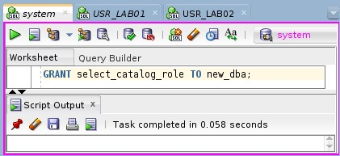<br>
    <em>Img 28 - Grant SELECT_CATALOG_ROLE role to new_dba</em>
</p>

### Grant role to `<user>`

```SQL
grant new_dba to USR_LAB01;
```

<p align="center">
    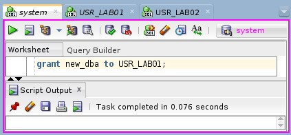<br>
    <em>Img 29 - Grant new_dba role to USR_LAB01</em>
</p>

## Test the role granted to `<user>`

We can separate the process of allowing the user `USR_LAB01` to access the `DBA_SYS_PRIVS` table into three simple steps:

1. Create a new role
2. Set up the role's permition  
    2.1. Grant the role the privilege to connect  
    2.2. Grant the necessary `SELECT` privileges  
3. Grant the new role to the user.

This approach is both simple and a best practice for managing user groups in the database.

```SQL
-- na janela do usuário usr_lab01. 
-- refaça a sua conexão para garantir que os privilégios tenham sido atualizados.
-- execute o comando e veja que ele funciona.
select * from dba_sys_privs;

-- explique como foi o processo de atribuição do privilégio ao usuário usr_lab01 que permitiu a ele acessa a tabela.
```

<p align="center">
    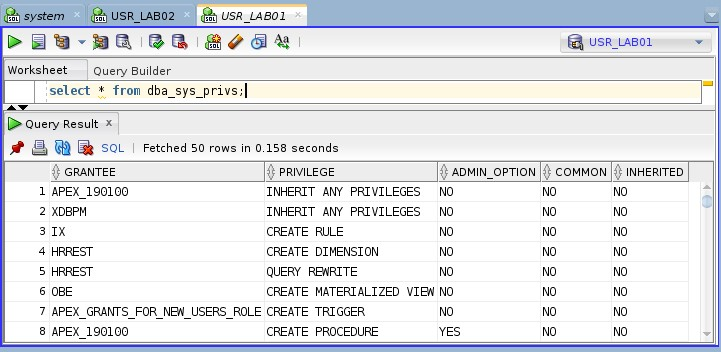<br>
    <em>Img 30 - User USR_LAB01 executes a SELECT query on dba_sys_privs table</em>
</p>

## Roles and privileges created on this lab

```SQL
-- Através das views a seguir, exibir os privilégios dos usuários e roles criados nesse lab.
SELECT * FROM DBA_ROLE_PRIVS;
SELECT * FROM DBA_SYS_PRIVS;
SELECT * FROM ROLE_ROLE_PRIVS;
SELECT * FROM ROLE_SYS_PRIVS;
SELECT * FROM ROLE_TAB_PRIVS;
```

### Table-level privileges that allow USR_LAB02 to access the USR_LAB01.xyz table 

```SQL
SELECT * FROM DBA_TAB_PRIVS WHERE GRANTEE IN ('USR_LAB01', 'USR_LAB02');
```

<p align="center">
    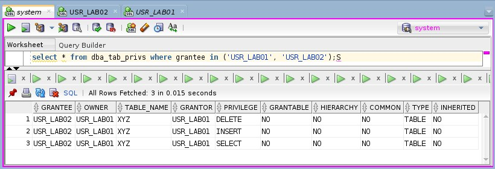<br>
    <em>Img 31 - Table USR_LAB01.xyz granted privileges to USR_LAB02</em>
</p>

### Roles granted directly to the users in this lab

```SQL
SELECT DISTINCT GRANTED_ROLE FROM DBA_ROLE_PRIVS WHERE GRANTEE IN ('USR_LAB01', 'USR_LAB02');
```

<p align="center">
    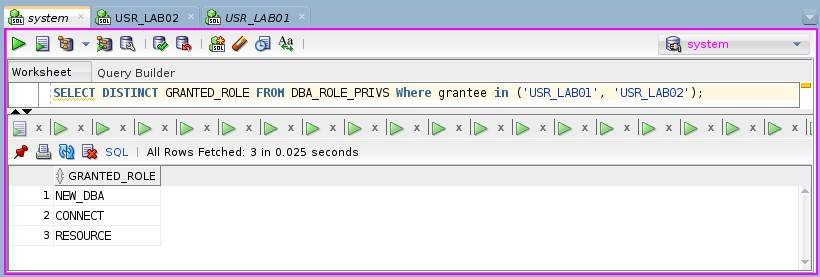<br>
    <em>Img 32 - Roles granted to the users USR_LAB01 and USR_LAB02</em>
</p>

### System privileges granted through roles to the users

```SQL
SELECT * FROM DBA_SYS_PRIVS
WHERE GRANTEE IN (
    SELECT DISTINCT GRANTED_ROLE
    FROM DBA_ROLE_PRIVS
    WHERE GRANTEE IN ('USR_LAB01', 'USR_LAB02')
);
```

<p align="center">
    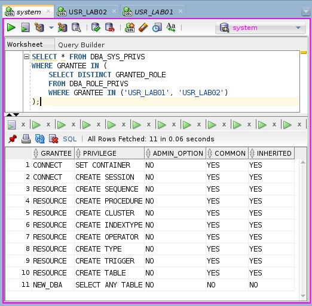<br>
    <em>Img 33 - System privileges granted to the users USR_LAB01 and USR_LAB02</em>
</p>

### Roles assigned to the NEW_DBA role created in this lab

```SQL
SELECT * FROM ROLE_ROLE_PRIVS WHERE ROLE IN ('NEW_DBA');
```

<p align="center">
    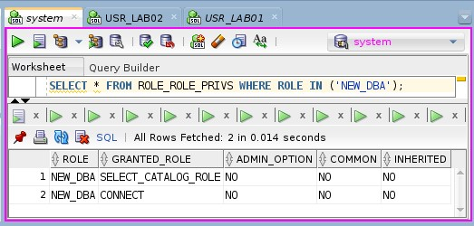<br>
    <em>Img 34 - Roles granted to new_dba role</em>
</p>