# Lab 02 - Transaction Control
Rafael Trevizoli - 1460282423016  
Professor Carlos Augusto Lombardi Garcia

**Topic:** [ADM_BD_02_2_transacoes2.pptx](topic/ADM_BD_02_2_transacoes2.pptx)  
**Lab:** [ADM_LAB_02_TRANSACIONAL.docx](lab/ADM_LAB_02_TRANSACIONAL.docx)

## Execution instructions
Each item of the experiment must be carried out and its result documented in the report.

## Lab objective
Understand and study transaction control and Oracle commands for connecting to remote servers.

## Part I

### 1. (Explicar o que significa o comando), também pode ser usado o SQL Developer

```bash
$ sqlplus /nolog
```

According to the help text of `sqlplus`. the command above starts SQL*Plus without connecting to any database. It will be handy when you're want to avoid automatic connections or run maintenance scripts for multiple databases or connect to multiple databases in a loop.

### 2. Conectar como usuário do banco de dados (em geral é o HR)

<p align="center">
    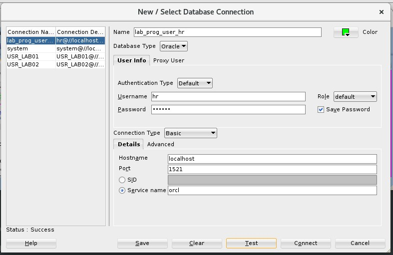<br>
    <em>Img 01 - Connect as the user HR</em>
</p>

### 3. Inserir uma linha numa tabela desse usuário sem executar commit

```SQL
INSERT INTO JOBS (
    JOB_ID, JOB_TITLE, MIN_SALARY, MAX_SALARY
) VALUES (
    'MG_DEV', 'Mega Dev', 50000.00, 100000.00
);
```

<p align="center">
    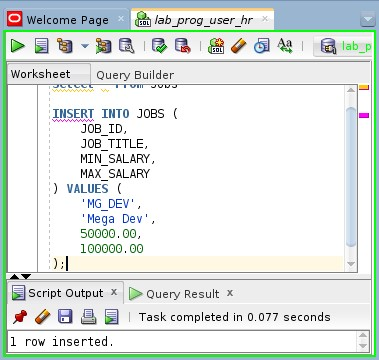<br>
    <em>Img 02 - Executes an INSERT query into jobs table</em>
</p>

### 4. Abrir outra janela com o SQLPlus e conectar com um usuário (pode ser o mesmo da etapa anterior)

<p align="center">
    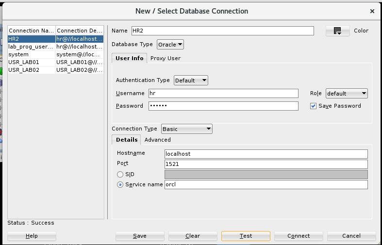<br>
    <em>Img 03 - Connect as HR on new conn</em>
</p>

### 5. Executar uma consulta que tente recuperar a linha inserida acima

```SQL
SELECT * FROM JOBS WHERE JOB_ID = 'MG_DEV';
```

<p align="center">
    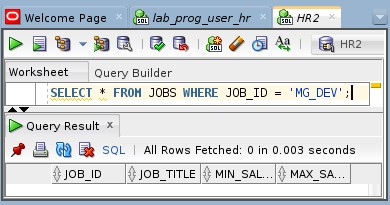<br>
    <em>Img 04 - Executes a SELECT query into jobs table on a new connection</em>
</p>

### 6. Documente o que aconteceu e explique

Performing a `SELECT` query in a new connection as the HR user, the record inserted in step 3 (without a commit) returns zero rows.

Indeed, the session did not actually register the `INSERT`.

### 7. Execute o `COMMIT` na primeira janela. Documente e explique (D & E - Documente & Explique)

The commit command is responsible for finalizing and registering the transaction started by the `INSERT` query, effectively recording the new data.

<p align="center">
    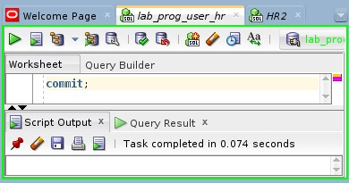<br>
    <em>Img 05 - Executes the commit in the first section</em>
</p>

### 8. Repetir a consulta da linha inserida (D & E)

The query returns the row recorded after the transaction commit.

<p align="center">
    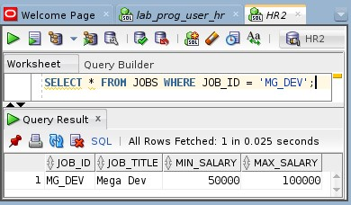<br>
    <em>Img 06 - Executes the SELECT query again (connected as HR)</em>
</p>

### 9. Na primeira janela, execute um `UPDATE` na linha inserida sem commit

```SQL
UPDATE JOBS
SET JOB_ID = 'SP_DEV', JOB_TITLE = 'Super Dev'
WHERE JOB_ID = 'MG_DEV';
```

<p align="center">
    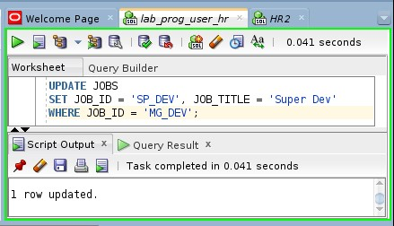<br>
    <em>Img 07 - Executes an UPDATE query in jobs table</em>
</p>

### 10. Na segunda janela, execute outro `UPDATE` na mesma linha (D & E)

The window got stuck while trying to perform the `UPDATE` query. The ScriptRunner task keep waiting.

```SQL
UPDATE JOBS
SET MIN_SALARY = 70000
WHERE JOB_ID = 'MG_DEV';
```

<p align="center">
    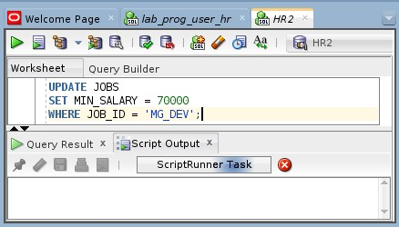<br>
    <em>Img 08 - Executes an UPDATE query without committing the last UPDATE in the same job (in a different session)</em>
</p>

### 11. Conectado como system, verifique a existência de lock (bloqueio) através do comando abaixo executado em um terceira janela.

```SQL
SELECT NVL(s.username, '(oracle)') AS username,
       s.sid,
       s.serial#,
       sw.event,
       sw.wait_class,
       sw.wait_time,
       sw.seconds_in_wait,
       sw.state
FROM   gv$session_wait sw,
       gv$session s
WHERE  s.sid = sw.sid
and lower(sw.event) like '%lock%'
ORDER BY sw.seconds_in_wait DESC;
```

<p align="center">
    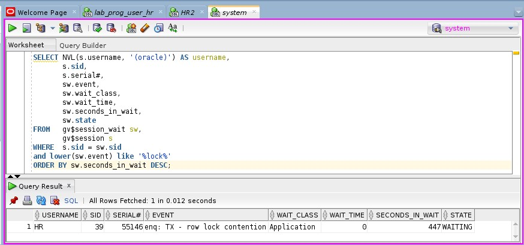<br>
    <em>Img 09 - Executes a SELECT query looking for db locks</em>
</p>

### 12. Para observar a hierarquia entre as sessões que estão gerando o lock nos registros, utilizar o comando abaixo.

```SQL
SELECT level,
       lpad(' ',(level - 1) * 2, ' ')
       || nvl(s.username, '(oracle)') AS username,
       s.osuser,
       s.sid,
       s.serial#,
       s.lockwait,
       s.status,
       s.module,
       s.machine,
       s.program,
       TO_CHAR(s.logon_time, 'DD-MON-YYYY HH24:MI:SS') AS logon_time,
       a.spid      processid,
       s.process   clientpid
FROM   gv$session   s,
       gv$process   a
WHERE  a.addr = s.paddr
       AND ( level > 1
             OR EXISTS (
              SELECT 1
              FROM   gv$session
              WHERE  blocking_session = s.sid 
             )
           )
CONNECT BY PRIOR s.sid = s.blocking_session
START WITH s.blocking_session IS NULL;
```

<p align="center">
    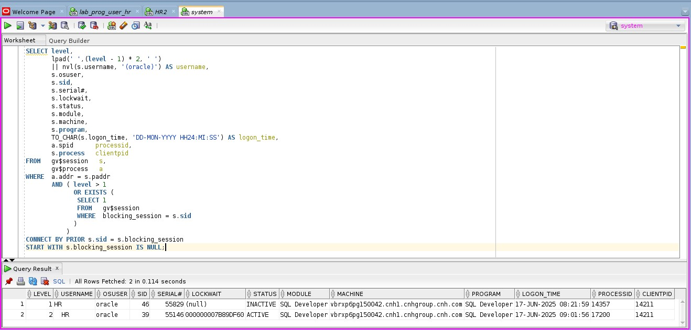<br>
    <em>Img 10 - Executes a SELECT query looking for section hierarchy</em>
</p>

### 13. Faça o `COMMIT` na Janela 01 (D & E)

After the `COMMIT` in the transaction running on Window 01, the second transaction running on Window 02 was executed, the lock was released, and the **Section Hierarchy** showed no entries related to lock generation.

#### Finalize the `UPDATE` in the window 01

<p align="center">
    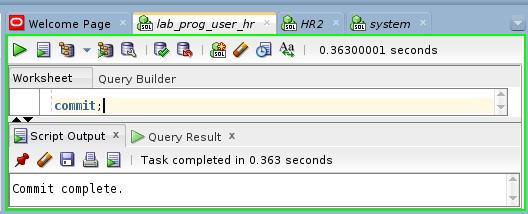<br>
    <em>Img 11 - Executes the commit in the window 1</em>
</p>

#### Window 02 after `COMMIT` in the window 01

<p align="center">
    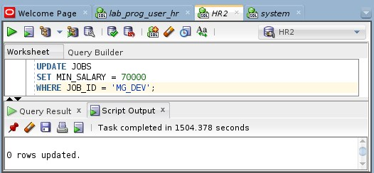<br>
    <em>Img 12 - Checks the UPDATE query in the window 2 after lock release</em>
</p>

#### Check the lock existance after `COMMIT` in the window 01

<p align="center">
    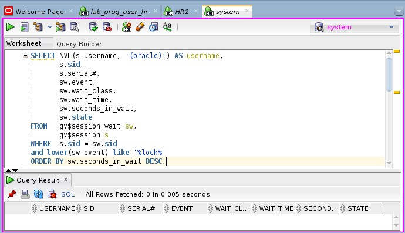<br>
    <em>Img 13 - Checks the lock existance after the commit in the window 1</em>
</p>

#### Check the cection hierarchy after `COMMIT` in the window 01

<p align="center">
    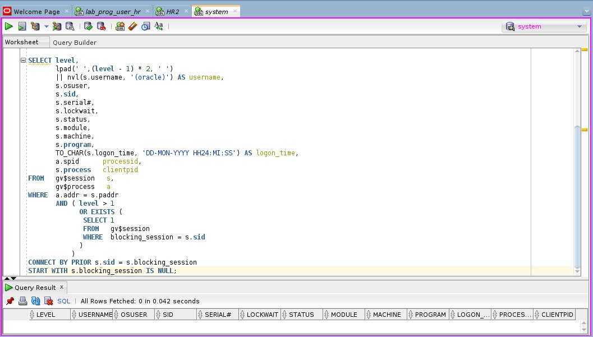<br>
    <em>Img 14 - Checks the section hierarchy after the lock release</em>
</p>


### 14. Finalize finalizando a transação da janela 2
There is nothing to commit or change here because the `UPDATE` query in Window 1 already changed the `JOB_ID`.

The `UPDATE` in Window 2 completed successfully but did not affect any rows.

## Part II

### 15. Realizar os procedimentos acima conectando no banco de um colega de sala. (indicar no relatório qual foi o colega escolhido)

> The procedure was executed by connecting to another virtual machine using VirtualBox, as shown in images 15 and 16 below.

<p align="center">
    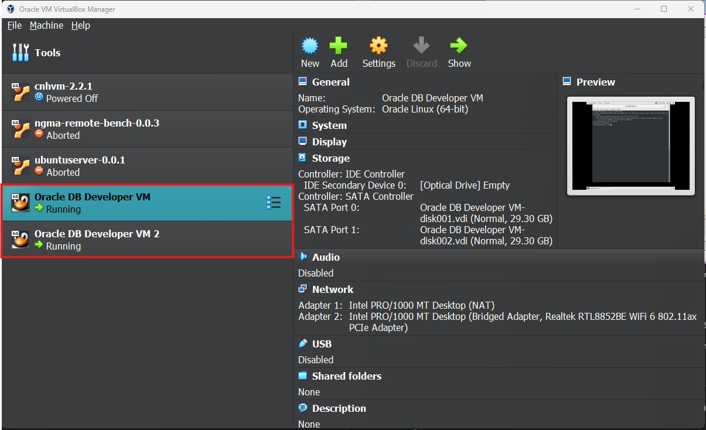<br>
    <em>Img 15 - VirtualBox VM list with both Oracle Linux Server</em>
</p>

<p align="center">
    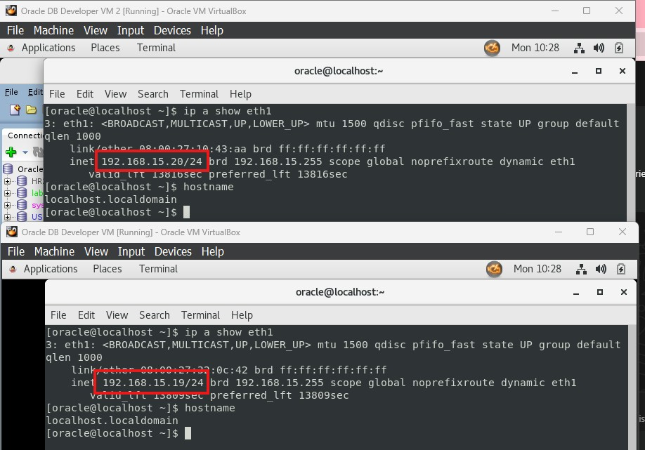<br>
    <em>Img 16 - Address of both VMs</em>
</p>

### 16. Para conectar em outro banco, precisa habilitar a porta 1521 no firewall do micro que será o servidor e configurar o arquivo tnsnames.ora da sua máquina para apontar para a do colega. (D & E)

```bash
$ nano $ORACLE_HOME/network/admin/tnsnames.ora 
```

#### Default structure of `tnsnames.ora`

```ora
<CONNECTION-IDENTIFICATRO> =
    (DESCRIPTION =
        (ADDRESS_LIST =
            (ADDRESS = (PROTOCOL = <PROTOCOL>)(HOST = <IP | HOSTNAME)(PORT = <PORT>))
        )
        (CONNECT_DATA =
            (SERVER = DEDICATED)
            (SERVICE_NAME = <SERVICE-NAME>)
        )
    )
```

#### `tnsnames.ora` after some changes

```ora
ORCLCDB=localhost:1521/orclcdb
ORCL=
    (DESCRIPTION =
        (ADDRESS = (PROTOCOL = TCP)(HOST = 0.0.0.0)(PORT = 1521))
        (CONNECT_DATA =
            (SERVER = DEDICATED)
            (SERVICE_NAME = orcl)
        )
    )

XE =
    (DESCRIPTION =
        (ADDRESS = (PROTOCOL = TCP)(HOST = 192.168.15.20)(PORT = 1521))
        (CONNECT_DATA =
            (SERVER = DEDICATED)
            (SERVICE_NAME = orcl)
        )
    )
```

### 17. Conectar como usuário do banco de dados (em geral é o HR)

<p align="center">
    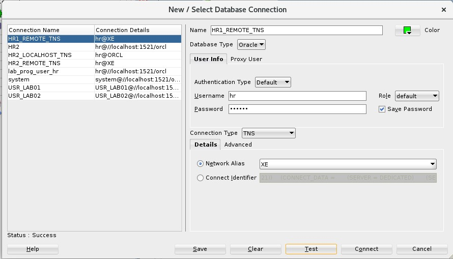<br>
    <em>Img 17 - Connect as the user HR on remote server using TNS conn type</em>
</p>

### 18. Inserir uma linha numa tabela desse usuário sem executar commit

```SQL
INSERT INTO JOBS (
    JOB_ID, JOB_TITLE, MIN_SALARY, MAX_SALARY
) VALUES (
    'CFO', 'Chief Financial Office', 50000.00, 100000.00
);
```

<p align="center">
    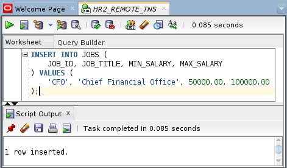<br>
    <em>Img 18 - Executes an INSERT query into jobs table</em>
</p>

### 19. Abrir outra janela com o SQLPlus e conectar com um usuário (pode ser o mesmo da etapa anterior)

<p align="center">
    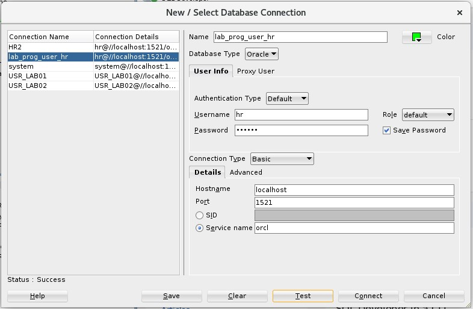<br>
    <em>Img 19 - Connect as HR on Oracle Server</em>
</p>

### 20. Executar uma consulta que tente recuperar a linha inserida acima

```SQL
SELECT * FROM JOBS WHERE JOB_ID = 'CFO';
```

<p align="center">
    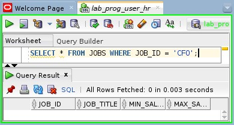<br>
    <em>Img 20 - Executes a SELECT query into jobs table on server as the HR user</em>
</p>

### 21. Documente o que aconteceu e explique

Performing a `SELECT` query in a new connection as the HR user, the record inserted in step 18 (without a commit) returns zero rows.

Indeed, the session did not actually register the `INSERT`.

### 22. Execute o `COMMIT` na primeira janela. Documente e explique (D & E - Documente & Explique)

The commit command is responsible for finalizing and registering the transaction started by the `INSERT` query, effectively recording the new data.

<p align="center">
    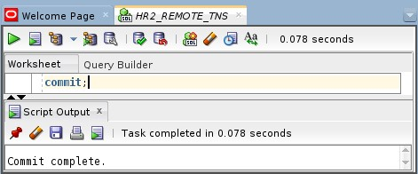<br>
    <em>Img 21 - Executes the commit in the first section</em>
</p>

### 23. Repetir a consulta da linha inserida (D & E)

The query returns the row recorded after the transaction commit.

<p align="center">
    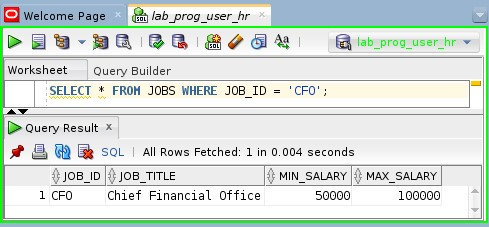<br>
    <em>Img 22 - Executes the SELECT query again (connected as HR)</em>
</p>

### 24. Na primeira janela, execute um `UPDATE` na linha inserida sem commit

```SQL
UPDATE JOBS
SET JOB_TITLE = 'Conselho Federal de Odontologia'
WHERE JOB_ID = 'CFO';
```

<p align="center">
    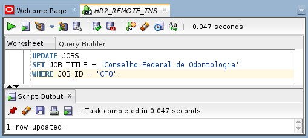<br>
    <em>Img 23 - Executes an UPDATE query in jobs table</em>
</p>

### 25. Na segunda janela, execute outro `UPDATE` na mesma linha (D & E)

The window got stuck while trying to perform the `UPDATE` query. The ScriptRunner task keep waiting.

```SQL
UPDATE JOBS
SET MIN_SALARY = 70000
WHERE JOB_ID = 'CFO';
```

<p align="center">
    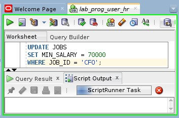<br>
    <em>Img 24 - Executes an UPDATE query without committing the last UPDATE in the same job (in a different session)</em>
</p>

### 26. Conectado como system, verifique a existência de lock (bloqueio) através do comando abaixo executado em um terceira janela.

```SQL
SELECT NVL(s.username, '(oracle)') AS username,
       s.sid,
       s.serial#,
       sw.event,
       sw.wait_class,
       sw.wait_time,
       sw.seconds_in_wait,
       sw.state
FROM   gv$session_wait sw,
       gv$session s
WHERE  s.sid = sw.sid
and lower(sw.event) like '%lock%'
ORDER BY sw.seconds_in_wait DESC;
```

<p align="center">
    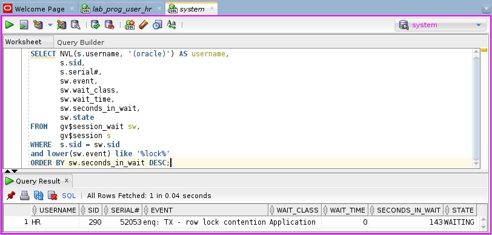<br>
    <em>Img 25 - Executes a SELECT query looking for db locks</em>
</p>

### 27. Para observar a hierarquia entre as sessões que estão gerando o lock nos registros, utilizar o comando abaixo.

```SQL
SELECT level,
       lpad(' ',(level - 1) * 2, ' ')
       || nvl(s.username, '(oracle)') AS username,
       s.osuser,
       s.sid,
       s.serial#,
       s.lockwait,
       s.status,
       s.module,
       s.machine,
       s.program,
       TO_CHAR(s.logon_time, 'DD-MON-YYYY HH24:MI:SS') AS logon_time,
       a.spid      processid,
       s.process   clientpid
FROM   gv$session   s,
       gv$process   a
WHERE  a.addr = s.paddr
       AND ( level > 1
             OR EXISTS (
              SELECT 1
              FROM   gv$session
              WHERE  blocking_session = s.sid 
             )
           )
CONNECT BY PRIOR s.sid = s.blocking_session
START WITH s.blocking_session IS NULL;
```

<p align="center">
    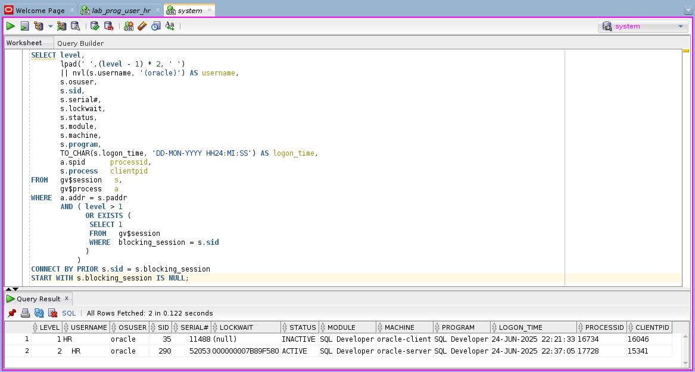<br>
    <em>Img 26 - Executes a SELECT query looking for section hierarchy</em>
</p>

### 28. Faça o `COMMIT` na Janela 01 (D & E)

After the `COMMIT` in the transaction running on Window 01, the second transaction running on Window 02 was executed, the lock was released, and the **Section Hierarchy** showed no entries related to lock generation.

#### Finalize the `UPDATE` in the window 01

<p align="center">
    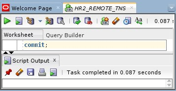<br>
    <em>Img 27 - Executes the commit in the window 1</em>
</p>

#### Window 02 after `COMMIT` in the window 01

> At this step, I had executed a `SELECT` query to check the updates, so I was no longer able to print the result from the lock release..

<p align="center">
    <br>
    <em>Img 28 - Checks the UPDATE query in the window 2 after lock release</em>
</p>

#### Check the lock existance after `COMMIT` in the window 01

<p align="center">
    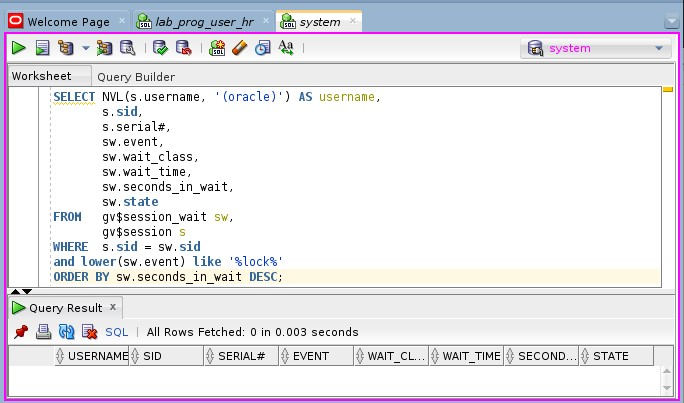<br>
    <em>Img 29 - Checks the lock existance after the commit in the window 1</em>
</p>

#### Check the cection hierarchy after `COMMIT` in the window 01

<p align="center">
    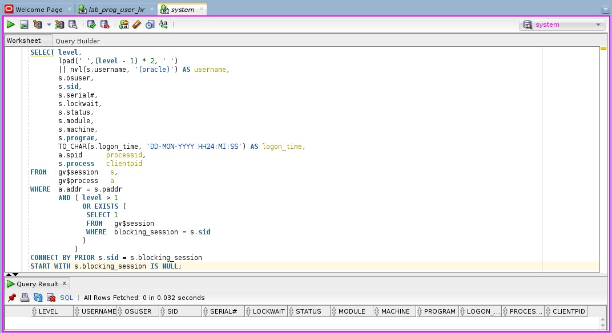<br>
    <em>Img 30 - Checks the section hierarchy after the lock release</em>
</p>

### 14. Finalize finalizando a transação da janela 2
There is nothing to commit or change here because the queries queued was commited in Window 1.