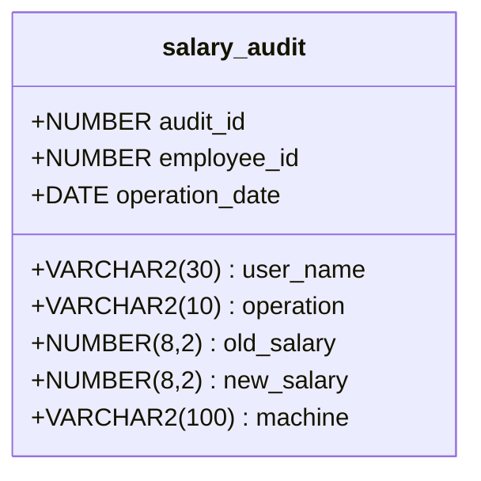
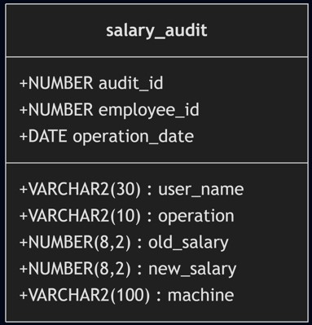
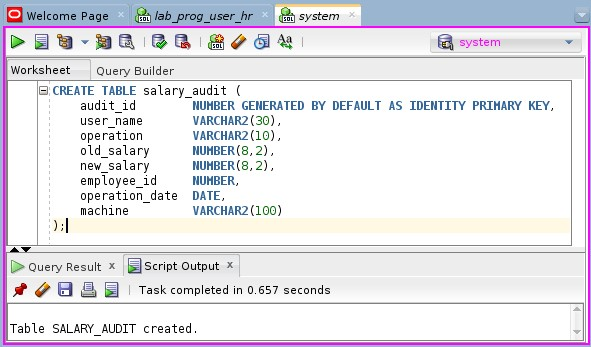
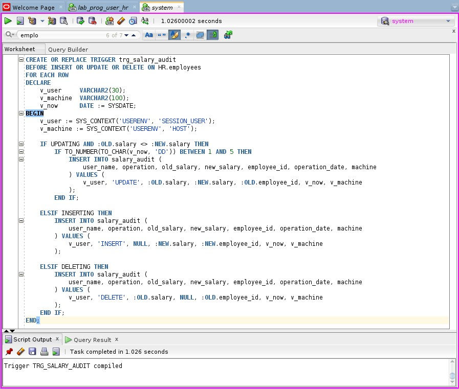

# Lab 03 - Audit
Rafael Trevizoli - 1460282423016  
Professor Carlos Augusto Lombardi Garcia

**Topic:** [ADM_BD_03.ppt](topic/ADM_BD_03.ppt)  
**Lab:** [Lab03_auditoria_trigger.txt](lab/Lab03_auditoria_trigger.txt)

## Execution instructions
Each item of the experiment must be carried out and its result documented in the report.

## Lab objective
The goal of this lab is to implement a database audit mechanism using a trigger in the Oracle HR schema. The main objective is to detect and document suspicious salary changes made by users who exploit the system by increasing their own salary just before payday (5th of each month), and then reverting it back afterward.

As the DBA, create the necessary tools to:
* Log salary changes between the 1st and 5th of each month.
* Identify abnormal behavior that might indicate policy violations or fraud.

## Diagram



<p align="center">
    <br>
    <em>Img 01 - salary_audit TABLE Diagram</em>
</p>

## DDL

```sql
CREATE TABLE salary_audit (
    audit_id        NUMBER GENERATED BY DEFAULT AS IDENTITY PRIMARY KEY,
    user_name       VARCHAR2(30),
    operation       VARCHAR2(10),
    old_salary      NUMBER(8,2),
    new_salary      NUMBER(8,2),
    employee_id     NUMBER,
    operation_date  DATE,
    machine         VARCHAR2(100)
);
```

<p align="center">
    <br>
    <em>Img 02 - Executes an CREATE TABLE query</em>
</p>

## Audit Trigger

```SQL
CREATE OR REPLACE TRIGGER trg_salary_audit
BEFORE INSERT OR UPDATE OR DELETE ON employees
FOR EACH ROW
DECLARE
    v_user     VARCHAR2(30);
    v_machine  VARCHAR2(100);
    v_now      DATE := SYSDATE;
BEGIN
    v_user := SYS_CONTEXT('USERENV', 'SESSION_USER');
    v_machine := SYS_CONTEXT('USERENV', 'HOST');

    IF UPDATING AND :OLD.salary <> :NEW.salary THEN
        IF TO_NUMBER(TO_CHAR(v_now, 'DD')) BETWEEN 1 AND 5 THEN
            INSERT INTO salary_audit (
                user_name, operation, old_salary, new_salary, employee_id, operation_date, machine
            ) VALUES (
                v_user, 'UPDATE', :OLD.salary, :NEW.salary, :OLD.employee_id, v_now, v_machine
            );
        END IF;

    ELSIF INSERTING THEN
        INSERT INTO salary_audit (
            user_name, operation, old_salary, new_salary, employee_id, operation_date, machine
        ) VALUES (
            v_user, 'INSERT', NULL, :NEW.salary, :NEW.employee_id, v_now, v_machine
        );

    ELSIF DELETING THEN
        INSERT INTO salary_audit (
            user_name, operation, old_salary, new_salary, employee_id, operation_date, machine
        ) VALUES (
            v_user, 'DELETE', :OLD.salary, NULL, :OLD.employee_id, v_now, v_machine
        );
    END IF;
END;
```

<p align="center">
    <br>
    <em>Img 03 - Executes the TRIGGER creation query</em>
</p>